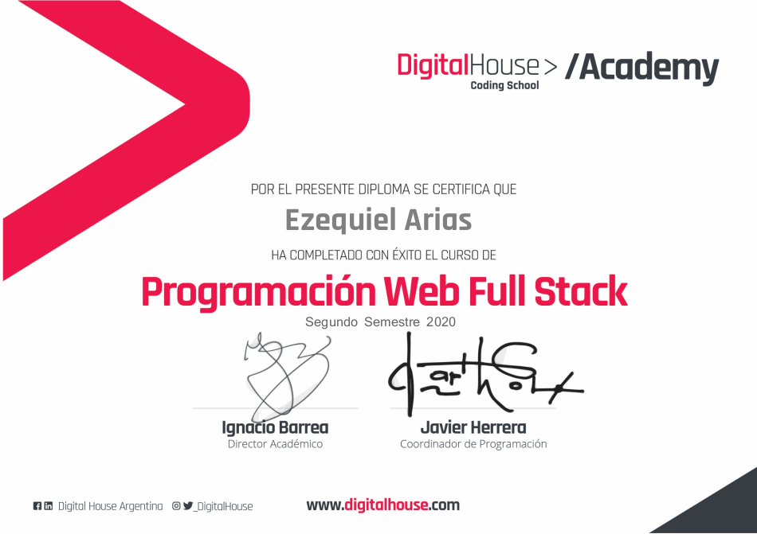

# React + Vite

This template provides a minimal setup to get React working in Vite with HMR and some ESLint rules.

- 🔭 &nbsp; Actualmente me encuentro estudiando en la universidad de la UBA y continuamente formandome como programador.
- 🤔 &nbsp; Explorar nuevas tecnologías y desarrollar soluciones de software.
- 💼 &nbsp; FullStack developer.
- 🌱 &nbsp; Entusiasta de la Ciberseguridad y la Inteligencia Artificial.
- 🚲 &nbsp; Creyente que salir a dar una vuelta en bici es la solucion a cualquier estrés.

<h3>🛠 Stack de tecnologías</h3>

- 🌐 &nbsp; Javascript | Typescript | ReactJS | HTML | CSS
- 💻 &nbsp; NodeJS | NestJS | JEST
- 🔧 &nbsp; Visual Studio code | Postman | Git
- 🛢 &nbsp; MySQL  

 

<h3> 🤝🏻 contacto. </h3>

&nbsp; 
&nbsp; 
&nbsp; 

<h2>Certificado de Digital House</h2>
<a href="https://github.com/thrasheremperor/grupo_6_biciBikes">Link al proyecto final realizado en Digital House</a>

Para mas proyectos o practicas seleccione cualquiera de la lista de abajo ⬇

